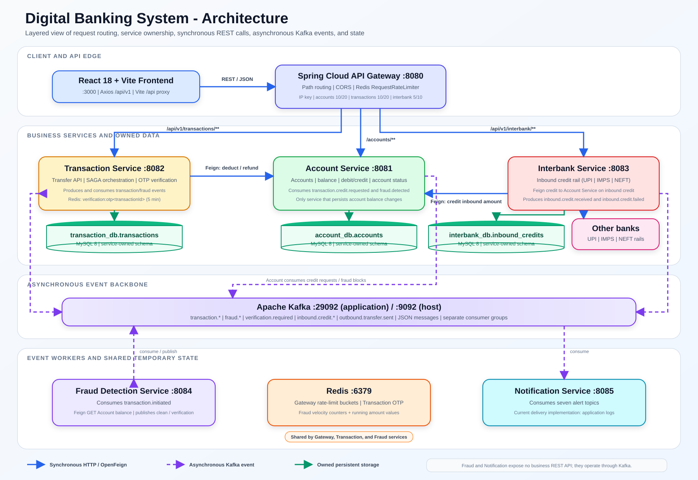
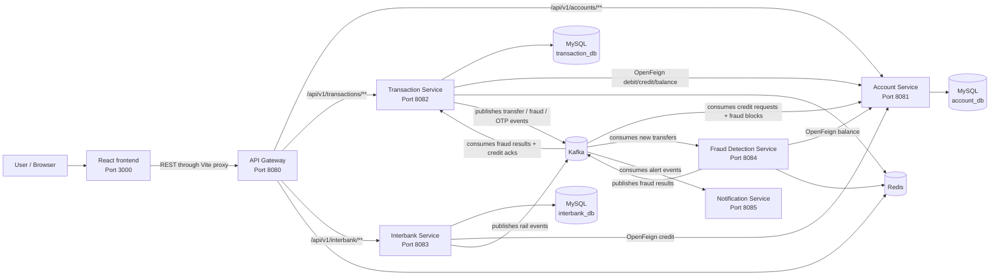
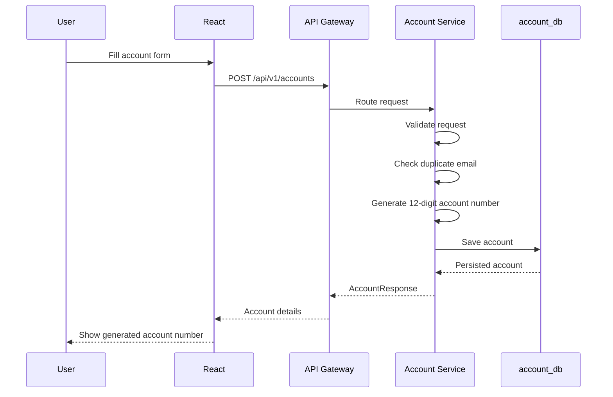
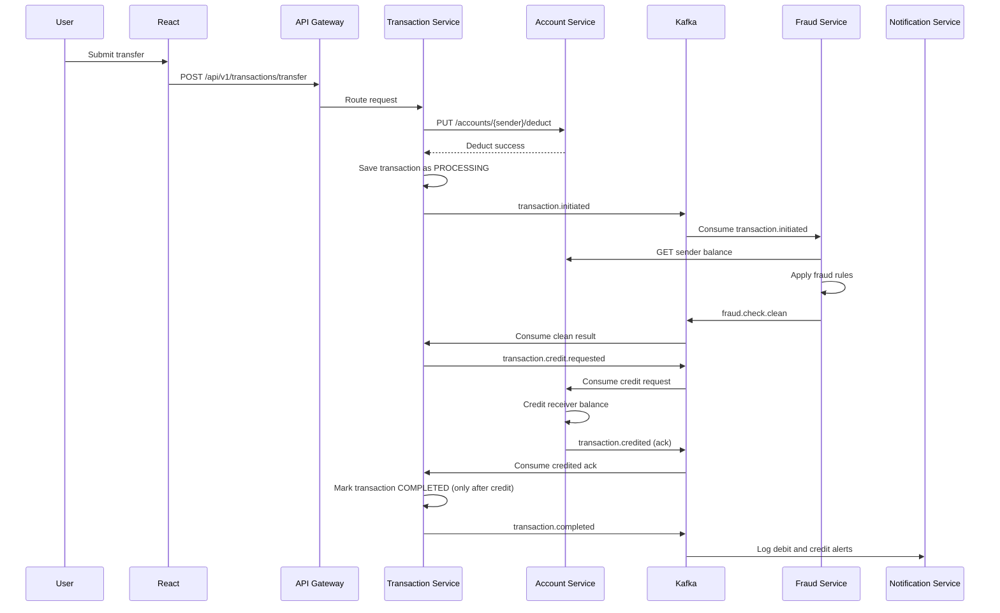
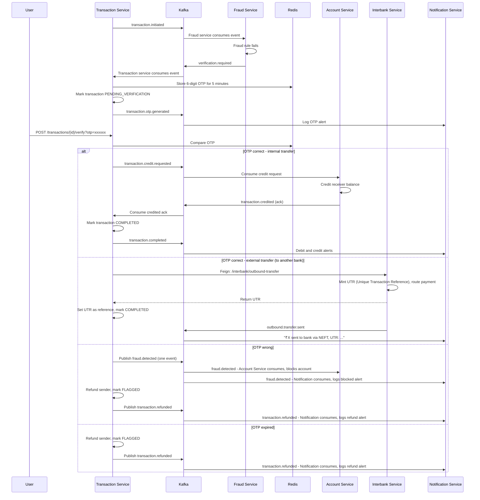
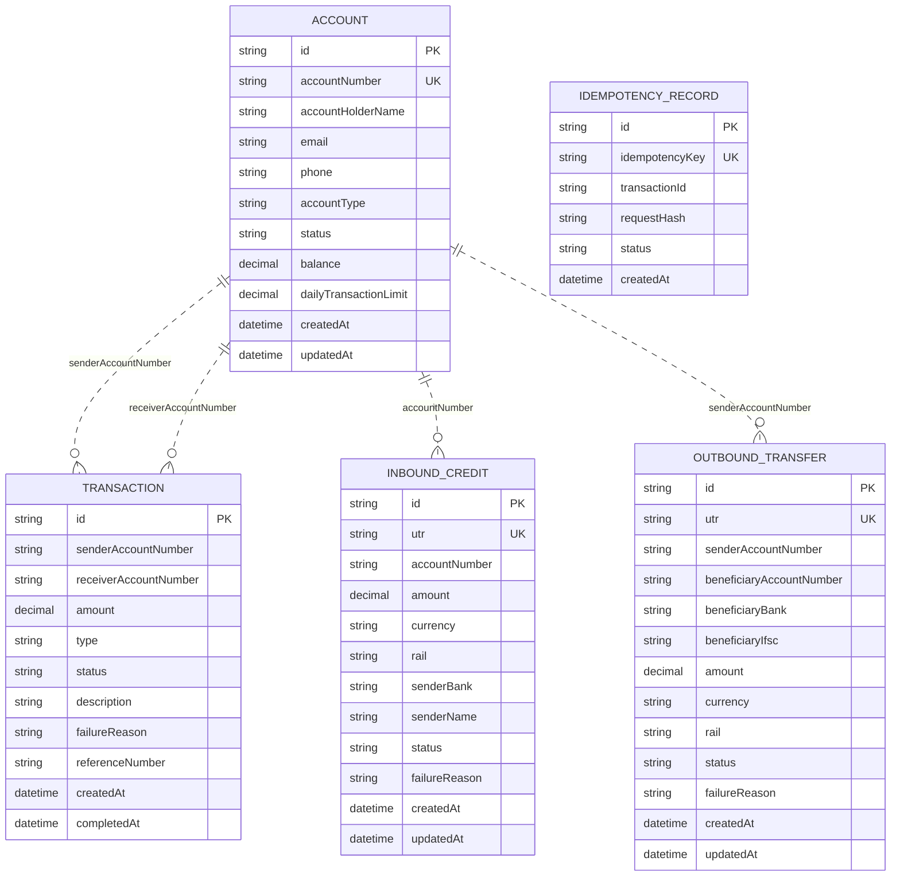

# Digital Banking System

Digital Banking System is a full-stack microservices banking application that demonstrates account management, money transfers, fraud detection, OTP-based step-up verification, inbound interbank credit handling, idempotent transfers, Redis-backed rate limiting, Kafka-based event communication, and a responsive React banking dashboard.

The system does not keep all banking logic inside one monolithic backend. Each core domain is separated into an independent Spring Boot service. The React frontend talks to a Spring Cloud API Gateway, and the gateway routes requests to account, transaction, and interbank services. Transaction risk handling is event-driven: every transfer emits a Kafka event, the fraud service checks it asynchronously, and the transaction service either completes the transfer or asks for OTP verification.

> Placement focus: this repository demonstrates microservice architecture, REST API design, Spring Boot, Spring Cloud Gateway, OpenFeign service-to-service calls, Kafka event-driven communication, Redis caching and rate limiting, MySQL persistence, saga-style compensation, idempotency keys, inbound interbank credit rail simulation, frontend state management, and banking-domain failure handling.

## Table of contents

- [Working application](#working-application)
- [Problem statement](#problem-statement)
- [Core features](#core-features)
- [Technology stack](#technology-stack)
- [System architecture](#system-architecture)
- [How banking operations work](#how-banking-operations-work)
- [Fraud detection and OTP verification](#fraud-detection-and-otp-verification)
- [Database design](#database-design)
- [API reference](#api-reference)
- [Kafka event reference](#kafka-event-reference)
- [Redis usage](#redis-usage)
- [Frontend application](#frontend-application)
- [Project structure](#project-structure)
- [Local setup](#local-setup)
- [Running and stopping the application](#running-and-stopping-the-application)
- [Build and validation](#build-and-validation)
- [Deployment notes](#deployment-notes)
- [Failure handling](#failure-handling)
- [Current limitations](#current-limitations)
- [Future improvements](#future-improvements)
- [Placement and interview guide](#placement-and-interview-guide)

---

## Working application

### System architecture diagram



The architecture diagram shows the frontend, API Gateway, backend services, MySQL databases, Redis, and Kafka-based event flow.

### Dashboard

The dashboard is the landing page of the React application. It allows users to search bank accounts and navigate to the main banking operations.

Main actions:

- create a new account;
- transfer money;
- view transaction history;
- add money to an account;
- inspect account details.

### Account creation

The Create Account page collects holder name, email, phone number, account type, and initial deposit. It calls the Account Service through the API Gateway and displays the generated 12-digit account number after success.

### Money transfer

The Transfer page accepts sender account number, receiver account number, transfer amount, and description. The backend deducts the sender balance, stores the transaction, runs fraud checks, and either completes the transaction or requires OTP verification.

For transfers to another bank, the page has an optional "transfer to another bank" toggle that adds a payment rail (UPI / IMPS / NEFT) and the beneficiary bank name. The money is then routed through the Interbank Service, which returns a Unique Transaction Reference (UTR) — exactly like a real NEFT/IMPS/UPI debit.

### OTP verification

Suspicious transfers are moved to `PENDING_VERIFICATION`. The transaction service generates a 6-digit OTP, stores it in Redis for 5 minutes, and publishes a notification event. The frontend displays an OTP modal when verification is needed.

### Transaction history

The Transactions page fetches transaction history by account number and displays transaction amount, status, description, counterparty account, creation time, and failure reason if present.

### Add money

The Add Money page directly calls the account credit endpoint to simulate a deposit (used to seed balances for testing). This is a simple deposit shortcut — it is separate from receiving money from another bank, which is handled by the Interbank Service (section 3b).

---

## Problem statement

A digital banking system must handle money movement safely while keeping services maintainable and scalable. Common problems include:

- creating and maintaining customer bank accounts;
- checking balance before money transfer;
- preventing transfers from blocked or inactive accounts;
- detecting suspicious transfer behavior;
- requiring additional verification for risky transactions;
- compensating users when part of a distributed transaction fails;
- notifying customers about debits, credits, fraud alerts, refunds, and inbound credits;
- receiving money from other banks and sending money to them over real-world rails (UPI, IMPS, NEFT) with a traceable Unique Transaction Reference (UTR);
- preventing double-execution when a transfer request is retried;
- guaranteeing no event is lost when Kafka is temporarily unavailable;
- protecting APIs from excessive traffic;
- keeping frontend, gateway, and backend services loosely coupled.

This project solves these problems using separate services and a saga-like transfer workflow.

| Domain | Problem solved | Implementation |
|---|---|---|
| Account management | Store account data and balance | Account Service + MySQL |
| Money transfer | Move money between accounts | Transaction Service + Account Service |
| Fraud checks | Detect suspicious transfer patterns | Fraud Detection Service + Redis |
| OTP verification | Step-up authentication for risky transfers | Transaction Service + Redis + Kafka |
| Compensation | Refund money after failed verification | Transaction Service saga compensation |
| Interbank rail | Receive from and send to other banks over UPI/IMPS/NEFT | Interbank Service |
| Notifications | Alert users after important events | Notification Service + Kafka |
| Traffic control | Avoid API abuse | API Gateway + Redis rate limiter |

---

## Core features

- Microservices-based banking backend.
- React frontend with dashboard and banking workflows.
- Spring Cloud Gateway as single backend entry point.
- Account creation with generated 12-digit account numbers.
- Account balance lookup and account blocking.
- Direct account credit and debit operations.
- Money transfer between accounts.
- Transaction history storage.
- Saga-style transaction flow with compensation.
- Kafka event publishing and consuming.
- Idempotency keys on transfers - retries never move money twice.
- Fraud detection using velocity, amount anomaly, and balance-percentage rules.
- OTP generation for suspicious transactions.
- Redis-backed OTP expiry after 5 minutes.
- Account blocking after wrong OTP.
- Automatic refund after wrong or expired OTP.
- Interbank rail simulation (UPI, IMPS, NEFT) - inbound credits and outbound transfers with UTR references.
- Inbound credit received/failed and outbound transfer sent events.
- Notification service that logs debit, credit, OTP, refund, fraud, and inbound credit alerts.
- Redis-backed gateway rate limiting.
- MySQL database per core data-owning service.
- Spring Boot Actuator health endpoints.
- Responsive Tailwind CSS frontend with dark-mode support.

---

## Technology stack

| Layer | Technologies |
|---|---|
| Frontend | React 18, Vite 5, React Router DOM, Axios, Tailwind CSS, Lucide React, React Hot Toast |
| API Gateway | Spring Boot 3.2.0, Spring Cloud Gateway, Redis Reactive Rate Limiter, Actuator |
| Backend services | Java 17, Spring Boot 3.2.0, Spring Web, Spring Data JPA, Jakarta Validation, Lombok |
| Service communication | REST, OpenFeign, Apache Kafka |
| Database | MySQL 8.0 |
| Cache / temporary state | Redis |
| Messaging | Kafka using Confluent Kafka Docker image |
| Interbank rails | Custom interbank rail simulation (UPI, IMPS, NEFT) |
| Build tools | Maven, npm, Vite |
| Infrastructure | Docker Compose |

### Default service ports

| Service | Port | Responsibility |
|---|---:|---|
| React frontend | `3000` | User interface |
| API Gateway | `8080` | Backend entry point, routing, CORS, rate limiting |
| Account Service | `8081` | Account creation, balance, debit, credit, blocking |
| Transaction Service | `8082` | Transfers, OTP verification, transaction history, compensation |
| Interbank Service | `8083` | Interbank rail simulation - inbound credits and outbound transfers |
| Fraud Detection Service | `8084` | Kafka-based fraud checks |
| Notification Service | `8085` | Kafka-based notification logging |
| MySQL | `3306` | Persistent databases |
| Redis | `6379` | OTPs, fraud counters, rate limiting |
| Kafka | `9092`, `9093` | Event streaming |

---

## System architecture



Arrow labels show the direction of events; the exact topic each service produces or consumes is listed in the [Kafka event reference](#kafka-event-reference) below.

### Component responsibilities

#### React frontend

- Displays the banking dashboard.
- Creates accounts through Account Service APIs.
- Searches account details and balances.
- Initiates money transfers.
- Displays transaction results and statuses.
- Shows OTP modal for suspicious transactions.
- Fetches transaction history.
- Simulates adding money to an account.
- Allows account blocking from the account details page.

#### API Gateway

- Receives all frontend API requests.
- Routes account, transaction, and interbank paths to their services.
- Applies CORS for frontend origins.
- Applies Redis-backed rate limiting.
- Exposes gateway actuator endpoints.

#### Account Service

- Owns account data and account balances.
- Creates accounts and generates account numbers.
- Deducts and credits balances.
- Blocks suspicious or manually blocked accounts.
- Credits receivers on `transaction.credit.requested` and acknowledges via `transaction.credited` / `transaction.credit.failed`.
- Blocks sender accounts after fraud events.

#### Transaction Service

- Owns transaction records.
- Starts transfers and deducts sender balance.
- Enforces idempotency so retried transfers never double-debit.
- Publishes transaction events for fraud checking.
- Completes clean transactions.
- Generates and verifies OTPs.
- Executes refund compensation.
- Publishes completion, refund, and fraud events.

#### Fraud Detection Service

- Listens to transfer initiation events.
- Uses account balance and Redis counters to detect suspicious behavior.
- Sends clean results or OTP-required events.

#### Interbank Service

- Simulates the interbank switch (NPCI / RBI / SWIFT) for both directions of the rail.
- **Inbound**: receives a credit message from another bank, validates it, posts it to the beneficiary account with a Unique Transaction Reference (UTR).
- **Outbound**: routes a payment message to the beneficiary's bank and returns a Unique Transaction Reference (UTR) (the sender is debited by Transaction Service first).
- Stores inbound credit and outbound transfer records for reconciliation.
- Publishes inbound credit received/failed and outbound transfer sent events.
- Relies on real-world payment rails (UPI, IMPS, NEFT, SWIFT) — the systems that actually move money between banks. See section 6 for how they work. A bank does not need a gateway layer: it is itself a participant on those rails.

#### Notification Service

- Listens to banking events.
- Logs customer-facing alerts for transfers, fraud, OTPs, refunds, and payments.
- Acts as the notification boundary of the system.

---

## How banking operations work

### 1. Account creation flow



Request body:

```json
{
  "accountHolderName": "Mohit Reddy",
  "email": "mohit@example.com",
  "phone": "9876543210",
  "accountType": "SAVINGS",
  "initialDeposit": 10000
}
```

Important rules:

- Email must be unique.
- Initial deposit must be positive.
- Account number is generated as a 12-digit string.
- New account status is `ACTIVE`.
- Daily limit is `100000` for `SAVINGS`; other types currently receive `500000`.

### 2. Account lookup flow

```text
Dashboard search
    -> GET /api/v1/accounts/{accountNumber}
    -> Account Service fetches by accountNumber
    -> AccountResponse returned
    -> Frontend displays holder, status, balance, type, email, phone, daily limit
```

### 3. Add money flow

```text
Add Money page (account number + amount)
    -> PUT /api/v1/accounts/{accountNumber}/credit?amount={amount}
    -> Account Service adds amount to balance
    -> Updated balance is persisted
    -> Frontend shows success toast
```

This is a development simulation endpoint used to seed balances. It is separate from receiving money from another bank — that flow is covered in section 3b below.

### 3b. Inbound interbank credit flow (receiving money from another bank)

```text
Another bank sends money through the rail (UPI / IMPS / NEFT)
    -> POST /api/v1/interbank/inbound-credit  (simulates the switch delivering the credit)
    -> Interbank Service mints a Unique Transaction Reference (UTR) (e.g. NEFT20260821012345)
    -> Inbound credit stored as RECEIVED
    -> Calls the account credit endpoint -> balance updated
    -> Credit marked COMPLETED
    -> inbound.credit.received published -> Notification logs "₹X credited via NEFT, UTR: ..."
    -> Response returns the Unique Transaction Reference (UTR)
```

This is the "receiving" side of external payments — money arriving from another bank. It is **not** the Add Money page: the Interbank Service calls the account credit endpoint directly, and the Add Money page is only a separate simple deposit shortcut for testing.

### 4. Normal transfer flow



The transaction is **not** marked `COMPLETED` when the fraud check passes. Transaction Service first publishes `transaction.credit.requested`; Account Service credits the receiver and replies with `transaction.credited`. Only after consuming that acknowledgment does Transaction Service set the status to `COMPLETED` and publish `transaction.completed` for notifications. If the credit fails, Account Service publishes `transaction.credit.failed` instead, and Transaction Service compensates by refunding the sender and marking the transaction `FLAGGED`.

For an **external transfer** (request carries `rail` / `beneficiaryBank`), the credit leg is different: instead of `transaction.credit.requested`, Transaction Service calls the Interbank Service outbound endpoint, which simulates the rail delivering the payment to the beneficiary's bank and returns a Unique Transaction Reference (UTR). The transaction is marked `COMPLETED` with the UTR as its reference. If the rail rejects the payment, the saga compensates by refunding the sender.

Transfer request:

```json
{
  "senderAccountNumber": "000012345678",
  "receiverAccountNumber": "000087654321",
  "amount": 5000,
  "description": "Rent payment"
}
```

External transfer request (adds the optional rail fields):

```json
{
  "senderAccountNumber": "000012345678",
  "receiverAccountNumber": "9988776655",
  "amount": 5000,
  "description": "School fees",
  "beneficiaryBank": "HDFC Bank",
  "beneficiaryIfsc": "HDFC0001234",
  "rail": "NEFT"
}
```

### 5. Suspicious transfer with OTP flow



> The two Kafka arrows in the wrong-OTP branch are **one** `fraud.detected` event delivered to **two** consumers — Account Service (blocks the account) and Notification Service (logs the alert). This is Kafka publish-subscribe: a single published event is received by every interested consumer group.

### 6. How banks communicate using trusted payment rails (UPI, IMPS, NEFT, SWIFT)

**In plain words:** a **rail** is the network that moves money between banks — like a road connecting two banks. UPI, IMPS, and NEFT are India's main payment rails, and SWIFT is the international one. A **UTR** (Unique Transaction Reference) is the receipt number the network returns when money moves — like a courier tracking number. When you send money to another bank, the sending bank quotes the UTR so the payment can be traced end to end.

In the real world, banks never move money by calling each other directly. Instead, they exchange standardized payment messages through trusted rails — central switches and networks operated by NPCI, RBI, or SWIFT — and settle the net positions between themselves. A bank initiates a transfer by sending a formatted payment message to the rail; the rail routes it to the destination bank and returns a unique settlement reference (UTR / transaction ID) that both banks keep for reconciliation and audit.

This is why a real banking system uses these rails behind its interbank service instead of treating every transfer as an internal ledger update:

| Rail | Used for | Operator | Settlement style | How it works (short) |
|---|---|---|---|---|
| **UPI** | Domestic instant payments, 24x7 | NPCI | Real-time push | Links an account to a Virtual Payment Address (VPA, e.g. `name@bank`). The payer's PSP bank sends a payment instruction to the UPI switch, which resolves the VPA to the payee's bank and routes the credit. Settlement is real-time push, and the switch returns a UTR (Unique Transaction Reference). |
| **IMPS** | Domestic instant payments, 24x7 | NPCI | Real-time push | Uses account number + IFSC (or MMID + mobile number) instead of a VPA. The IMPS switch routes the payment message to the beneficiary bank and settles it instantly, returning a UTR (Unique Transaction Reference). |
| **NEFT** | Domestic deferred transfers | RBI | Batched, net settlement | Payments are queued and settled in half-hourly batches (48 batches a day). Messages accumulate during each batch window, net positions are computed, and RBI settles them between bank accounts — so there is no real-time push, and money moves within the next batch. |
| **SWIFT** | International transfers | SWIFT network | Correspondent banking | Banks do not hold accounts with every foreign bank, so they route through correspondent banks. The sending bank transmits an MT103 payment message over the SWIFT network to the correspondent/beneficiary bank; funds move through nostro (our account held at their bank) and vostro (their account held at our bank) relationships. Settlement takes 1–4 business days and typically involves FX conversion. |

Key concepts behind how banks communicate on these rails:

- **Messaging standards**: rails exchange structured messages — ISO 20022 / UPI formats for NPCI rails, and SWIFT MT (e.g. MT103) for international transfers — never free-form text.
- **Switches and clearing**: NPCI (UPI/IMPS) and RBI (NEFT) act as the central switch that validates, routes, and clears each payment between member banks.
- **Settlement and netting**: UPI/IMPS settle in real time; NEFT settles on a deferred net basis in batches; SWIFT settles through correspondent account balances.
- **UTR (Unique Transaction Reference)**: every settled payment gets a UTR, which both banks store so transactions can be traced end-to-end and reconciled.

---

## Idempotency

### Why idempotency matters for money movement

When a client submits a transfer and the network times out, it retries. Without protection, a retry would debit the sender twice. Transaction Service therefore accepts an `Idempotency-Key` header on `POST /api/v1/transactions/transfer` (the React frontend generates `crypto.randomUUID()` per submit):

```text
POST /api/v1/transactions/transfer
Idempotency-Key: 3f0e6c42-...
```

How it works ([TransactionService.java:105](transaction-service/src/main/java/com/banking/transactionservice/service/TransactionService.java:105)):

1. The key is inserted into `idempotency_records` first (unique constraint) — the insert acts as a lock.
2. A concurrent duplicate blocks on the insert, then fails with a constraint violation, and is served the original transaction's response. The money moves exactly once.
3. A replay of the same key returns the stored transaction without re-executing.
4. The stored request hash prevents one key from being reused with a different request body.
5. Keys expire after 24 hours.

---

## Fraud detection and OTP verification

Fraud Detection Service checks every transfer after Transaction Service publishes `transaction.initiated`.

### Fraud rules

| Rule | Source | Condition | Result |
|---|---|---|---|
| Velocity check | Redis key `fraud:velocity{accountNumber}` | More than 5 transactions in 60 seconds | OTP required |
| Amount anomaly check | Redis key `fraud:avg_amount{accountNumber}` | Current amount is more than 3x running average | OTP required |
| Balance percentage check | Account Service balance API | Transfer amount exceeds 90% of sender balance | OTP required |

Fraud configuration:

```yaml
fraud:
  max-transactions-per-minute: 5
  suspicious-amount-multiplier: 3.0
  max-balance-percentage: 0.90
```

### OTP lifecycle

```text
verification.required event
    -> generate 6-digit OTP
    -> store Redis key verification:otp{transactionId}
    -> expiry: 5 minutes
    -> set transaction status PENDING_VERIFICATION
    -> publish transaction.otp.generated
    -> user submits OTP
    -> compare OTP
        -> correct (internal): request receiver credit -> credited ack -> COMPLETED -> alerts
        -> correct (external): interbank outbound -> UTR -> COMPLETED -> sent alert
        -> wrong: block account (fraud.detected) + refund sender + FLAGGED
        -> expired: refund sender + FLAGGED
```

OTP results:

| Case | Behavior |
|---|---|
| Correct OTP - internal transfer | `transaction.credit.requested` is published; Account Service credits the receiver and acks with `transaction.credited`; only then the transaction becomes `COMPLETED`, `transaction.completed` is published, and debit/credit alerts are logged. |
| Correct OTP - external transfer | Transaction Service calls the Interbank Service outbound endpoint; the rail returns a UTR (Unique Transaction Reference), which becomes the transaction reference; transaction becomes `COMPLETED` and the sender gets an `outbound.transfer.sent` alert ("sent to bank via NEFT, UTR: ..."). |
| Expired OTP | Sender is refunded, transaction becomes `FLAGGED`, `transaction.refunded` is published, and a refund alert is logged. |
| Wrong OTP | `fraud.detected` is published - Account Service blocks the sender account and a blocked-account alert is logged; the sender is refunded, transaction becomes `FLAGGED`, and a refund alert is logged. |

### Saga compensation

The transfer flow uses a saga-like pattern because money is deducted before fraud verification and receiver credit finish. If the transaction cannot safely complete — wrong/expired OTP, or a `transaction.credit.failed` event when the receiver could not be credited — Transaction Service compensates by crediting the amount back to the sender account and marking the transaction `FLAGGED`.

```text
Debit sender
    -> fraud/OTP failure
    -> credit sender back
    -> mark transaction FLAGGED
    -> publish refund notification event
```

---

## Database design

The project follows a database-per-service style for the services that own persistent data.



Mongo-style relationships are not used here. The application uses MySQL tables and account numbers as business identifiers across service boundaries. There are no database-level foreign keys across services because each service owns its own database.

### `account_db.accounts`

| Field | Type | Notes |
|---|---|---|
| `id` | String UUID | Primary key generated by JPA. |
| `account_number` | String | Unique, not null, generated 12-digit account number. |
| `account_holder_name` | String | Not null. |
| `email` | String | Not null. Duplicate email is blocked by service logic. |
| `phone` | String | Not null. |
| `account_type` | Enum string | `SAVINGS`, `CURRENT`, `FIXED_DEPOSIT`. |
| `status` | Enum string | `ACTIVE`, `BLOCKED`, `CLOSED`. |
| `balance` | Decimal(15,2) | Current account balance. |
| `daily_transaction_limit` | Decimal(15,2) | Assigned when account is created. |
| `created_at` | DateTime | Hibernate creation timestamp. |
| `updated_at` | DateTime | Hibernate update timestamp. |

### `transaction_db.transactions`

| Field | Type | Notes |
|---|---|---|
| `id` | String UUID | Primary key generated by JPA. |
| `sender_account_number` | String | Sender account business identifier. |
| `receiver_account_number` | String | Receiver account business identifier. |
| `amount` | Decimal(15,2) | Transfer amount. |
| `type` | Enum string | `TRANSFER`, `DEPOSIT`, `WITHDRAWAL`, `PAYMENT`. |
| `status` | Enum string | `PENDING`, `PROCESSING`, `PENDING_VERIFICATION`, `COMPLETED`, `FAILED`, `FLAGGED`. |
| `description` | String | Optional transfer note. |
| `failure_reason` | String | Reason when flagged or failed. |
| `reference_number` | String | UUID reference generated by Transaction Service; replaced by the rail Unique Transaction Reference (UTR) for external transfers. |
| `beneficiary_bank` | String | Null for internal transfers; beneficiary bank name for external transfers. |
| `beneficiary_ifsc` | String | Null for internal transfers; beneficiary IFSC for external transfers. |
| `rail` | String | Null for internal transfers; `UPI`, `IMPS`, or `NEFT` for external transfers. |
| `created_at` | DateTime | Hibernate creation timestamp. |
| `completed_at` | DateTime | Set after successful completion. |

#### `id` vs `reference_number`

Both fields are UUIDs but serve different roles:

| Field | Role | Generated by | Used for |
|---|---|---|---|
| `id` | Internal system identifier (primary key). | Hibernate at insert time (`GenerationType.UUID`). | `findById` lookups, Kafka message keys, OTP Redis keys. Never shown to the user. |
| `reference_number` | Customer-facing business reference. | Transaction Service at creation: `UUID.randomUUID()` ([TransactionService.java:63](transaction-service/src/main/java/com/banking/transactionservice/service/TransactionService.java:63)). | Receipts, customer support, reconciliation (UTR-style; UTR = Unique Transaction Reference). Returned in `TransactionResponse` and shown in the UI as "Ref". |

There is no derivation between them — `reference_number` is an independent random UUID, not computed from `id`, so a customer cannot derive one from the other.

### `interbank_db.inbound_credits`

| Field | Type | Notes |
|---|---|---|
| `id` | String UUID | Primary key generated by JPA. |
| `utr` | String | Unique Transaction Reference (UTR) minted by the service (e.g. `NEFT20260821012345`). |
| `account_number` | String | Beneficiary account credited. |
| `amount` | Decimal(15,2) | Credit amount. |
| `currency` | String | Current value is `INR`. |
| `rail` | Enum string | `UPI`, `IMPS`, `NEFT`. |
| `sender_bank` | String | Optional sender bank name. |
| `sender_name` | String | Optional sender name. |
| `status` | Enum string | `RECEIVED`, `COMPLETED`, `FAILED`. |
| `failure_reason` | String | Reason when the credit could not be posted. |
| `created_at` | DateTime | Hibernate creation timestamp. |
| `updated_at` | DateTime | Hibernate update timestamp. |

### `interbank_db.outbound_transfers`

| Field | Type | Notes |
|---|---|---|
| `id` | String UUID | Primary key generated by JPA. |
| `utr` | String | Unique Transaction Reference (UTR) minted by the service (e.g. `NEFT20260821123456`). |
| `sender_account_number` | String | Sender account that was debited by Transaction Service. |
| `beneficiary_account_number` | String | Beneficiary account at the other bank. |
| `beneficiary_bank` | String | Beneficiary bank name. |
| `beneficiary_ifsc` | String | Beneficiary bank IFSC. |
| `amount` | Decimal(15,2) | Transfer amount. |
| `currency` | String | Current value is `INR`. |
| `rail` | String | `UPI`, `IMPS`, or `NEFT`. |
| `status` | Enum string | `RECEIVED`, `COMPLETED`, `FAILED`. |
| `failure_reason` | String | Reason when the rail rejected the payment. |
| `description` | String | Optional note. |
| `created_at` | DateTime | Hibernate creation timestamp. |
| `updated_at` | DateTime | Hibernate update timestamp. |

### `transaction_db.idempotency_records`

| Field | Type | Notes |
|---|---|---|
| `id` | String UUID | Primary key generated by JPA. |
| `idempotency_key` | String | Unique. Client-provided key from the `Idempotency-Key` header. |
| `transaction_id` | String | Transaction executed for this key (null while in progress). |
| `request_hash` | String | Hash of the request body so a key cannot be reused with a different request. |
| `status` | Enum string | `IN_PROGRESS`, `COMPLETED`. |
| `created_at` | DateTime | Used for the 24-hour key TTL. |

---

## API reference

All user-facing backend requests should go through API Gateway:

```text
http://localhost:8080
```

The React app uses Axios with:

```js
baseURL: '/api/v1'
```

The Vite development server proxies `/api` to `http://localhost:8080`.

### Gateway routes

| Gateway route | Target service | Target URI | Rate limit |
|---|---|---|---|
| `/api/v1/accounts/**` | Account Service | `http://localhost:8081` | replenish 10, burst 20 |
| `/api/v1/transactions/**` | Transaction Service | `http://localhost:8082` | replenish 10, burst 20 |
| `/api/v1/interbank/**` | Interbank Service | `http://localhost:8083` | replenish 5, burst 10 |

Rate limiting is implemented with Spring Cloud Gateway's `RequestRateLimiter` filter backed by a Redis token bucket ([application.yml:32-57](api-gateway/src/main/resources/application.yml:32)). The bucket is keyed by client IP via `KeyResolver` ([RateLimiterConfig.java:9](api-gateway/src/main/java/com/banking/apigateway/config/RateLimiterConfig.java:9)).

- **replenishRate** — tokens added to the bucket per second; the steady-state request rate a client can sustain.
- **burstCapacity** — maximum bucket size; a client may fire up to `burstCapacity` requests at once when the bucket is full, after which the bucket refills at `replenishRate` per second.

For example, the transaction route allows a burst of 20 requests immediately, then settles to 10 requests/second. Requests beyond the bucket are rejected with `429 Too Many Requests`. Redis is used so the bucket state is shared and consistent across gateway instances.

### Account endpoints

Base path:

```text
/api/v1/accounts
```

| Method | Endpoint | Purpose | Request | Main response |
|---|---|---|---|---|
| `POST` | `/api/v1/accounts` | Create account | JSON body | `AccountResponse` |
| `GET` | `/api/v1/accounts/{accountNumber}` | Get account details | Path variable | `AccountResponse` |
| `GET` | `/api/v1/accounts/{accountNumber}/balance` | Get balance | Path variable | Decimal balance |
| `PUT` | `/api/v1/accounts/{accountNumber}/block` | Block account | Path variable | Success message |
| `PUT` | `/api/v1/accounts/{accountNumber}/deduct?amount={amount}` | Deduct balance | Query parameter | Success message |
| `PUT` | `/api/v1/accounts/{accountNumber}/credit?amount={amount}` | Credit balance | Query parameter | Success message |

#### `POST /api/v1/accounts`

```json
{
  "accountHolderName": "Demo User",
  "email": "demo@example.com",
  "phone": "9876543210",
  "accountType": "SAVINGS",
  "initialDeposit": 10000
}
```

Response:

```json
{
  "id": "uuid",
  "accountNumber": "000012345678",
  "accountHolderName": "Demo User",
  "email": "demo@example.com",
  "phone": "9876543210",
  "accountType": "SAVINGS",
  "status": "ACTIVE",
  "balance": 10000,
  "dailyTransactionLimit": 100000,
  "createdAt": "2026-08-20T10:00:00"
}
```

### Transaction endpoints

Base path:

```text
/api/v1/transactions
```

| Method | Endpoint | Purpose | Request | Main response |
|---|---|---|---|---|
| `POST` | `/api/v1/transactions/transfer` | Transfer money | JSON body | `TransactionResponse` |
| `GET` | `/api/v1/transactions/{transactionId}` | Get transaction by ID | Path variable | `TransactionResponse` |
| `GET` | `/api/v1/transactions/account/{accountNumber}` | Get sender transaction history | Path variable | List of transactions |
| `POST` | `/api/v1/transactions/{transactionId}/verify?otp={otp}` | Verify OTP | Query parameter | Updated transaction |

#### `POST /api/v1/transactions/transfer`

```json
{
  "senderAccountNumber": "000012345678",
  "receiverAccountNumber": "000087654321",
  "amount": 2500,
  "description": "Monthly rent"
}
```

Response:

```json
{
  "id": "uuid",
  "senderAccountNumber": "000012345678",
  "receiverAccountNumber": "000087654321",
  "amount": 2500,
  "type": "TRANSFER",
  "status": "PROCESSING",
  "description": "Monthly rent",
  "referenceNumber": "uuid-reference",
  "failureReason": null,
  "createdAt": "2026-08-20T10:10:00",
  "completedAt": null
}
```

#### `POST /api/v1/transactions/{transactionId}/verify?otp={otp}`

```bash
curl -X POST "http://localhost:8080/api/v1/transactions/{transactionId}/verify?otp=123456"
```

Possible final outcomes:

| Result | Transaction status | Side effect |
|---|---|---|
| Correct OTP | `COMPLETED` (only after the `transaction.credited` ack) | Receiver is credited first, then the transaction is marked completed. |
| Expired OTP | `FLAGGED` | Sender gets refunded. |
| Wrong OTP | `FLAGGED` | Sender gets refunded and account is blocked. |

### Interbank endpoints

Base path:

```text
/api/v1/interbank
```

| Method | Endpoint | Purpose | Request | Main response |
|---|---|---|---|---|
| `POST` | `/api/v1/interbank/inbound-credit` | Simulate an inbound credit from another bank | JSON body | `InboundCreditResponse` |
| `GET` | `/api/v1/interbank/credits/{accountNumber}` | Inbound credit history for an account | Path variable | List of credits |
| `POST` | `/api/v1/interbank/outbound-transfer` | Simulate sending a payment to another bank | JSON body | `OutboundTransferResponse` |
| `GET` | `/api/v1/interbank/outbound/{accountNumber}` | Outbound transfer history for an account | Path variable | List of transfers |

#### `POST /api/v1/interbank/inbound-credit`

```json
{
  "accountNumber": "000012345678",
  "amount": 1000,
  "rail": "UPI",
  "senderBank": "HDFC Bank",
  "senderName": "Mohit Reddy"
}
```

`rail` is `UPI`, `IMPS`, or `NEFT`. `senderBank` and `senderName` are optional.

Response (`status: COMPLETED`):

```json
{
  "creditId": "uuid",
  "utr": "UPI20260821123456",
  "accountNumber": "000012345678",
  "amount": 1000,
  "currency": "INR",
  "rail": "UPI",
  "senderBank": "HDFC Bank",
  "senderName": "Mohit Reddy",
  "status": "COMPLETED",
  "failureReason": null,
  "createdAt": "2026-08-21T10:00:00"
}
```

If the account cannot be credited, `status` is `FAILED` and `failureReason` explains why.

#### `POST /api/v1/interbank/outbound-transfer`

Called by Transaction Service when a transfer targets another bank (the sender has already been debited). `rail` is `UPI`, `IMPS`, or `NEFT`.

```json
{
  "senderAccountNumber": "000012345678",
  "beneficiaryAccountNumber": "9988776655",
  "beneficiaryBank": "HDFC Bank",
  "beneficiaryIfsc": "HDFC0001234",
  "amount": 5000,
  "rail": "NEFT",
  "description": "School fees"
}
```

Response:

```json
{
  "transferId": "uuid",
  "utr": "NEFT20260821123456",
  "senderAccountNumber": "000012345678",
  "beneficiaryAccountNumber": "9988776655",
  "beneficiaryBank": "HDFC Bank",
  "amount": 5000,
  "currency": "INR",
  "rail": "NEFT",
  "status": "COMPLETED",
  "failureReason": null,
  "createdAt": "2026-08-21T10:05:00"
}
```

### Actuator endpoints

Common service health endpoint:

```text
/actuator/health
```

Common service info endpoint:

```text
/actuator/info
```

API Gateway additionally exposes:

```text
/actuator/gateway
```

---

## Kafka event reference

Kafka enables asynchronous communication between services.

### Topic catalog

| Topic | Producer | Consumer | Purpose |
|---|---|---|---|
| `transaction.initiated` | Transaction Service | Fraud Detection Service | Start fraud check for a new transfer. |
| `fraud.check.clean` | Fraud Detection Service | Transaction Service | Continue a safe transaction (request receiver credit). |
| `verification.required` | Fraud Detection Service | Transaction Service | Ask for OTP verification for a suspicious transaction. |
| `transaction.otp.generated` | Transaction Service | Notification Service | Notify user that OTP was generated. |
| `transaction.credit.requested` | Transaction Service | Account Service | Ask Account Service to credit the receiver account. |
| `transaction.credited` | Account Service | Transaction Service | Acknowledge receiver credit succeeded; only then mark the transaction `COMPLETED`. |
| `transaction.credit.failed` | Account Service | Transaction Service | Receiver credit failed; refund sender and mark transaction `FLAGGED`. |
| `transaction.completed` | Transaction Service | Notification Service | Send debit/credit alerts after the receiver credit was acknowledged. |
| `transaction.refunded` | Transaction Service | Notification Service | Notify sender that refund compensation happened. |
| `fraud.detected` | Transaction Service | Account Service, Notification Service | Block sender account and alert user after wrong OTP. |
| `inbound.credit.received` | Interbank Service | Notification Service | Notify user that money arrived via UPI/IMPS/NEFT with the Unique Transaction Reference (UTR). |
| `inbound.credit.failed` | Interbank Service | Notification Service | Notify user that an inbound credit could not be posted. |
| `outbound.transfer.sent` | Interbank Service | Notification Service | Notify sender that a payment to another bank was sent, with the Unique Transaction Reference (UTR). |

### Event-driven transfer summary

```text
transfer request
    -> transaction.initiated
    -> fraud.check.clean OR verification.required
    -> transaction.credit.requested
    -> transaction.credited (mark COMPLETED) OR transaction.credit.failed (refund sender + FLAGGED)
    -> transaction.completed / transaction.refunded
    -> notification events consumed and logged
```

### Why Kafka is used

Kafka keeps services loosely coupled. Transaction Service does not directly call Notification Service or Fraud Detection Service. It publishes events, and the interested services react independently. This makes the system easier to extend with audit logging, analytics, SMS, email, or compliance services later.

### Kafka — things to know

**In plain words:** Kafka is the post office of your microservices. Services never call each other for events — they drop letters (events) into named mailboxes (topics), and any service that is interested reads its own copy. The sender does not wait for, or even know about, the receivers.

- **Topic** — a named channel, e.g. `transaction.initiated`. Producers publish to it, consumers read from it.
- **Producer** — the service that publishes an event (e.g. Transaction Service publishes `fraud.detected`).
- **Consumer group** — each service has its own group (`account-service-group`, `transaction-service-group`, `fraud-detection-group`, `notification-service-group`), so every interested service gets its own copy of every event.
- **Offset** — each group's bookmark, tracking "I have read up to this message". Groups advance their bookmarks independently.
- **One event, many consumers** — publish-subscribe. `fraud.detected` is published once but delivered to two groups: Account Service (blocks the account) and Notification Service (logs the alert).
- **Consuming never deletes** — a message stays in the topic after being read. It is removed only by retention (by default about 7 days, or once the topic exceeds its size limit), so a new group joining with `auto-offset-reset: earliest` can replay history from the start.
- **At-least-once delivery** — if a consumer crashes between reading and finishing, it re-reads the message. Consumers should therefore be idempotent (another reason the transfer endpoint has idempotency keys).

---

## Redis usage

| Use case | Service | Key / mechanism | Purpose |
|---|---|---|---|
| API rate limiting | API Gateway | Spring Cloud Gateway RedisRateLimiter | Limits requests per client IP. |
| OTP storage | Transaction Service | `verification:otp{transactionId}` | Stores OTP for 5 minutes. |
| Velocity fraud check | Fraud Detection Service | `fraud:velocity{accountNumber}` | Counts transfers within 60 seconds. |
| Average amount fraud check | Fraud Detection Service | `fraud:avg_amount{accountNumber}` | Maintains running average transaction amount. |

Redis is used because these data items are short-lived and need fast read/write access.

### Redis — things to know

**In plain words:** Redis is a super-fast in-memory dictionary (key → value) with a timer on every entry. Reads and writes take microseconds, and keys can be told to delete themselves after a set time.

- **TTL (time to live)** — a key auto-deletes after N seconds. The OTP is stored with a 5-minute TTL ([TransactionEventConsumer.java:62](transaction-service/src/main/java/com/banking/transactionservice/service/TransactionEventConsumer.java:62)); after that it is gone, which is exactly the "OTP expired" case in the OTP flow.
- **Atomic counters** — `increment()` is atomic, so concurrent requests cannot lose count. The velocity fraud check uses `fraud:velocity{accountNumber}` to count transfers per account and flags the account if the count exceeds the limit within 60 seconds ([FraudDetectionService.java:111](fraud-detection-service/src/main/java/com/banking/frauddetectionservice/service/FraudDetectionService.java:111)).
- **Running averages** — `fraud:avg_amount{accountNumber}` keeps a running average transfer amount so the fraud service can flag amounts far above the account's usual pattern.
- **Shared rate-limit buckets** — the gateway's rate limiter stores its token bucket in Redis, so multiple gateway instances share one bucket per client IP instead of each having its own (inconsistent) limit.
- **Why not MySQL?** — OTPs and fraud counters are read/written on every request, expire in seconds, and would create unnecessary database load. In-memory access with TTL is the right tool; MySQL stays the source of truth for accounts and transactions.

---

## Frontend application

Frontend source directory:

```text
frontend/src
```

### Routes

| Browser route | Component | Purpose |
|---|---|---|
| `/` | `Dashboard` | Search account and show feature cards. |
| `/create-account` | `CreateAccount` | Create a new bank account. |
| `/transfer` | `Transfer` | Transfer money and handle OTP flow. |
| `/transactions` | `Transactions` | Fetch transaction history by account number. |
| `/add-money` | `AddMoney` | Simulate a deposit to an account. |
| `/account/:accountNumber` | `AccountDetails` | View account details and block account. |

### API functions

Defined in `frontend/src/services/api.js`.

| Function | Backend call |
|---|---|
| `createAccount(data)` | `POST /accounts` |
| `getAccount(accountNumber)` | `GET /accounts/{accountNumber}` |
| `getBalance(accountNumber)` | `GET /accounts/{accountNumber}/balance` |
| `blockAccount(accountNumber)` | `PUT /accounts/{accountNumber}/block` |
| `creditBalance(accountNumber, amount)` | `PUT /accounts/{accountNumber}/credit?amount={amount}` |
| `transferMoney(data)` | `POST /transactions/transfer` (sends an `Idempotency-Key` header generated with `crypto.randomUUID()`) |
| `getTransaction(transactionId)` | `GET /transactions/{transactionId}` |
| `getTransactionHistory(accountNumber)` | `GET /transactions/account/{accountNumber}` |
| `verifyOTP(transactionId, otp)` | `POST /transactions/{transactionId}/verify?otp={otp}` |
| `submitInboundCredit(data)` | `POST /interbank/inbound-credit` |
| `getInboundCredits(accountNumber)` | `GET /interbank/credits/{accountNumber}` |

### UI behavior

- Toasts show success and error messages.
- Transfer result card shows ID, status, sender, receiver, amount, reference, and failure reason.
- Transfer page has an optional "transfer to another bank" toggle (rail UPI/IMPS/NEFT + beneficiary bank); the result card shows the rail and bank for external transfers.
- OTP modal accepts a 6-digit numeric OTP.
- Transaction list displays sent/received styling based on the searched account.
- Account Details page has a manual block button for active accounts.
- Tailwind CSS classes implement responsive and dark UI styling.

---

## Project structure

```text
DigitalBankingSystem/
├── README.md
├── docker-compose.yml
├── docs/
│   └── diagrams/
│       ├── system-architecture.svg
│       └── system-arc.jpg
├── frontend/
│   ├── package.json
│   ├── vite.config.js
│   └── src/
│       ├── App.jsx
│       ├── services/api.js
│       ├── context/ThemeContext.jsx
│       ├── components/
│       │   ├── Navbar.jsx
│       │   ├── OTPModal.jsx
│       │   └── StatusBadge.jsx
│       └── pages/
│           ├── Dashboard.jsx
│           ├── CreateAccount.jsx
│           ├── Transfer.jsx
│           ├── Transactions.jsx
│           ├── AddMoney.jsx
│           └── AccountDetails.jsx
├── api-gateway/
│   ├── pom.xml
│   └── src/main/
│       ├── java/com/banking/apigateway/
│       │   ├── ApiGatewayApplication.java
│       │   └── config/RateLimiterConfig.java
│       └── resources/application.yml
├── account-service/
│   ├── pom.xml
│   └── src/main/
│       ├── java/com/banking/accountservice/
│       │   ├── controller/AccountController.java
│       │   ├── service/AccountService.java
│       │   ├── model/Account.java
│       │   ├── model/AccountStatus.java
│       │   ├── model/AccountType.java
│       │   ├── repository/AccountRepository.java
│       │   ├── dto/
│       │   └── exception/GlobalExceptionHandler.java
│       └── resources/application.yml
├── transaction-service/
│   ├── pom.xml
│   └── src/main/
│       ├── java/com/banking/transactionservice/
│       │   ├── controller/TransactionController.java
│       │   ├── service/TransactionService.java
│       │   ├── service/TransactionEventConsumer.java
│       │   ├── client/AccountServiceClient.java
│       │   ├── config/RedisConfig.java
│       │   ├── model/
│       │   ├── repository/
│       │   └── dto/
│       └── resources/application.yml
├── fraud-detection-service/
│   ├── pom.xml
│   └── src/main/
│       ├── java/com/banking/frauddetectionservice/
│       │   ├── service/FraudDetectionService.java
│       │   ├── service/TransactionEventConsumer.java
│       │   ├── client/AccountServiceClient.java
│       │   ├── config/RedisConfig.java
│       │   └── model/FraudCheckResult.java
│       └── resources/application.yml
├── interbank-service/
│   ├── pom.xml
│   └── src/main/
│       ├── java/com/banking/interbankservice/
│       │   ├── controller/InterbankController.java
│       │   ├── service/InboundCreditService.java
│       │   ├── service/OutboundTransferService.java
│       │   ├── client/AccountServiceClient.java
│       │   ├── config/CorsConfig.java
│       │   ├── model/InboundCredit.java
│       │   ├── model/OutboundTransfer.java
│       │   ├── model/Rail.java
│       │   ├── model/InboundCreditStatus.java
│       │   ├── model/OutboundTransferStatus.java
│       │   ├── repository/InboundCreditRepository.java
│       │   ├── repository/OutboundTransferRepository.java
│       │   ├── util/UtrGenerator.java
│       │   └── dto/
│       └── resources/application.yml
└── notification-service/
    ├── pom.xml
    └── src/main/
        ├── java/com/banking/notificationservice/
        │   ├── NotificationServiceApplication.java
        │   └── service/NotificationService.java
        └── resources/application.yml
```

---

## Local setup

### Prerequisites

| Tool | Recommended minimum |
|---|---|
| Java JDK | 17 |
| Maven | 3.8+ |
| Node.js | 18+ |
| npm | Bundled with Node.js |
| Docker | Latest stable |
| Docker Compose | Latest stable |

### Infrastructure setup

Start infrastructure from the project root:

```bash
docker compose up -d
```

This starts:

- MySQL 8.0 with root password `root`;
- Redis on port `6379`;
- Kafka with auto topic creation enabled.

### Database setup

No manual SQL script is required for local development. Service database URLs use:

```text
createDatabaseIfNotExist=true
```

Spring JPA is configured with:

```yaml
spring:
  jpa:
    hibernate:
      ddl-auto: update
```

Databases created automatically:

| Service | Database |
|---|---|
| Account Service | `account_db` |
| Transaction Service | `transaction_db` |
| Interbank Service | `interbank_db` |

No external credentials are required. The Interbank Service simulates the inbound credit rail locally, so there are no gateway keys, webhook secrets, or third-party accounts to configure.

---

## Running and stopping the application

### Recommended startup order

1. Infrastructure: MySQL, Redis, Kafka
2. Account Service
3. Transaction Service
4. Fraud Detection Service
5. Notification Service
6. Interbank Service
7. API Gateway
8. Frontend

### Start infrastructure

```bash
docker compose up -d
```

### Start backend services

Open one terminal per service.

```bash
cd account-service
mvn spring-boot:run
```

```bash
cd transaction-service
mvn spring-boot:run
```

```bash
cd fraud-detection-service
mvn spring-boot:run
```

```bash
cd notification-service
mvn spring-boot:run
```

```bash
cd interbank-service
mvn spring-boot:run
```

```bash
cd api-gateway
mvn spring-boot:run
```

### Start frontend

```bash
cd frontend
npm install
npm run dev
```

Open:

```text
http://localhost:3000
```

### Stop application

Stop frontend and Spring Boot services with `Ctrl+C` in each terminal.

Stop infrastructure:

```bash
docker compose down
```

To also remove MySQL volume data:

```bash
docker compose down -v
```

Use the volume-removal command only when you intentionally want to delete local database data.

---

## Build and validation

### Backend build

Run inside each Spring Boot service directory:

```bash
mvn clean package
```

Services:

```text
account-service
transaction-service
fraud-detection-service
notification-service
interbank-service
api-gateway
```

### Frontend build

```bash
cd frontend
npm install
npm run build
```

### Frontend preview

```bash
cd frontend
npm run preview
```

### Health checks

```text
http://localhost:8080/actuator/health
http://localhost:8081/actuator/health
http://localhost:8082/actuator/health
http://localhost:8083/actuator/health
http://localhost:8084/actuator/health
http://localhost:8085/actuator/health
```

---

## Deployment notes

This repository currently provides Docker Compose only for infrastructure services, not for every application service.

For production-style deployment, add:

- Dockerfile for each Spring Boot service;
- Dockerfile for React frontend;
- environment-specific configuration files;
- secure secret management for database, Kafka, and Redis credentials;
- service discovery or container-network service URLs;
- HTTPS reverse proxy;
- observability stack for logs, metrics, traces, and alerts.

---

## Failure handling

| Failure | Current behavior |
|---|---|
| Duplicate email during account creation | Account Service throws runtime error; mapped to bad request by account exception handler. |
| Account not found | Account Service returns not found through exception handler. |
| Blocked sender account | Deduct operation fails because account is not active. |
| Insufficient balance | Deduct operation fails before transaction is saved. |
| Fraud service marks transaction risky | Transaction moves to OTP verification instead of completing immediately. |
| OTP expired | Sender is refunded and transaction is marked `FLAGGED`. |
| Wrong OTP | Sender is refunded, transaction is marked `FLAGGED`, and sender account is blocked. |
| Inbound credit posted | Credit marked `COMPLETED`, account credited, `inbound.credit.received` event published. |
| Inbound credit failed (e.g. account not found) | Credit marked `FAILED` with reason, `inbound.credit.failed` event published. |
| Duplicate transfer request (same idempotency key) | Original transaction returned; sender is not debited twice. |
| Notification delivery | Current implementation logs notifications rather than sending external messages. |
| Kafka topic missing | Kafka auto topic creation is enabled in Docker Compose. |

---

## Current limitations

- No user authentication or authorization is implemented.
- Any caller can access local APIs if they know the endpoint.
- The direct account credit endpoint is still exposed (used by the Interbank Service internally); it should be hidden behind service-level authorization.
- Notification Service logs alerts instead of sending email, SMS, or push notifications.
- Transaction history repository fetches by sender account number only.
- Cross-service consistency relies on custom compensation logic, not distributed transactions.
- Idempotency is implemented for transfers; the inbound credit endpoint and other services do not yet use keys.
- External (outbound) transfers are simulated locally by the Interbank Service; there is no real NPCI/RBI connectivity.
- No retry, dead-letter topic, or idempotency layer is implemented for Kafka consumers.
- No database migrations are included; schema is managed by Hibernate `ddl-auto: update`.
- No automated test suite is present under service `src/test` directories.
- Services use fixed localhost URLs instead of service discovery.
- Account balance updates do not currently use optimistic locking.

---

## Future improvements

- Add Spring Security with JWT-based user authentication.
- Add role-based access for admin, customer, and support users.
- Hide internal debit and credit endpoints behind service-level authorization.
- Add idempotency keys to the inbound credit endpoint and other money-moving APIs.
- Add consumer-side idempotency plus Kafka retry and dead-letter topics.
- Integrate a real NPCI / RBI sandbox or test API for UPI, IMPS, or NEFT instead of the local simulation.
- Add optimistic locking or database-level locking for balance updates.
- Add service discovery using Eureka, Consul, or Kubernetes DNS.
- Add API documentation with OpenAPI/Swagger.
- Add Flyway or Liquibase migrations.
- Add Testcontainers integration tests for MySQL, Kafka, and Redis.
- Add end-to-end tests for frontend workflows.
- Add centralized logging and tracing with OpenTelemetry.
- Add metrics dashboards for service health, latency, and Kafka lag.
- Add real notification channels through email, SMS, or push.
- Add transaction history for receiver accounts as well as sender accounts.
- Add audit logs for balance-changing operations.
- Add daily transaction limit enforcement.
- Add account closure and reactivation workflows.

---

## Placement and interview guide

### 30-second project explanation

> Digital Banking System is a full-stack microservices banking application built with React, Spring Boot, MySQL, Redis, and Kafka. The React frontend sends requests to a Spring Cloud API Gateway. Account Service manages accounts and balances, Transaction Service handles transfers with saga compensation and idempotency keys, Fraud Detection Service checks risky transactions asynchronously, Interbank Service simulates the UPI/IMPS/NEFT rails in both directions — receiving credits from other banks and sending transfers to them, with UTR references — and Notification Service consumes Kafka events to log alerts. Redis is used for OTP expiry, fraud counters, and rate limiting, while MySQL stores account, transaction, inbound credit, outbound transfer, and idempotency data.

### Important design decisions to explain

1. **Why microservices?**  
   Each domain has separate ownership: accounts, transactions, fraud, payments, notifications, and gateway routing. This improves modularity and scalability.

2. **Why API Gateway?**  
   The frontend needs one backend entry point. Gateway centralizes routing, CORS, and rate limiting.

3. **Why Kafka?**  
   Fraud checks and notifications do not need to block the initial HTTP request. Kafka decouples services and supports event-driven workflows.

4. **Why Redis?**  
   OTPs, fraud counters, and rate-limit counters are temporary and require fast reads/writes with expiry support.

5. **Why OpenFeign?**  
   Some operations need immediate synchronous responses, such as deducting balance before starting a transaction or fetching account balance for fraud checks.

6. **How is distributed consistency handled?**  
   The project uses saga compensation. Sender debit, fraud/OTP checks, and receiver credit are separate steps, and the transaction is marked `COMPLETED` only after Account Service acknowledges the receiver credit via `transaction.credited`. If any step fails — wrong or expired OTP, or a `transaction.credit.failed` event — Transaction Service credits the sender back and marks the transaction as flagged.

7. **How does fraud detection work?**  
   Fraud Detection Service applies velocity, amount anomaly, and balance percentage rules. Suspicious transactions require OTP verification instead of completing immediately.

8. **How do you stop a retried transfer from debiting twice?**  
   Every transfer carries an `Idempotency-Key`. The key is inserted with a unique constraint before the money moves, so a concurrent duplicate blocks and is then served the original result; a replay returns the stored transaction.

9. **What is the biggest production gap?**  
    Authentication, locking for balance updates, consumer-side idempotency with retry/dead-letter topics, and real rail integration should be added before production.

### Resume-ready description

> Built a full-stack digital banking platform using React, Spring Boot microservices, MySQL, Redis, Kafka, Spring Cloud Gateway, and OpenFeign. Implemented account management, money transfers (internal and external-bank), fraud detection, OTP-based verification, saga compensation refunds, idempotency keys, bidirectional interbank rail simulation (UPI/IMPS/NEFT with UTRs), event-driven notifications, gateway routing, and Redis-backed rate limiting.

### Concepts demonstrated

- Microservices architecture.
- API Gateway pattern.
- REST API design.
- Event-driven architecture with Kafka.
- Saga pattern and compensation.
- Idempotency key design for money movement.
- Redis TTL-based OTP handling.
- Fraud detection rule engine.
- Spring Data JPA and MySQL schema modeling.
- OpenFeign inter-service communication.
- Interbank rail modeling (UPI, IMPS, NEFT) - inbound credits and outbound transfers with UTRs.
- React routing and frontend state management.
- Docker Compose infrastructure setup.

### Suggested interview walkthrough

1. Start with the architecture diagram.
2. Explain the role of each microservice.
3. Walk through account creation.
4. Walk through money transfer.
5. Explain why fraud detection is asynchronous.
6. Explain OTP verification and Redis expiry.
7. Explain compensation after failed OTP.
8. Explain Kafka topics and consumers.
9. Explain database-per-service design.
10. End with limitations and production improvements.

---

## License

No license file is currently included. Add a license before public distribution.
