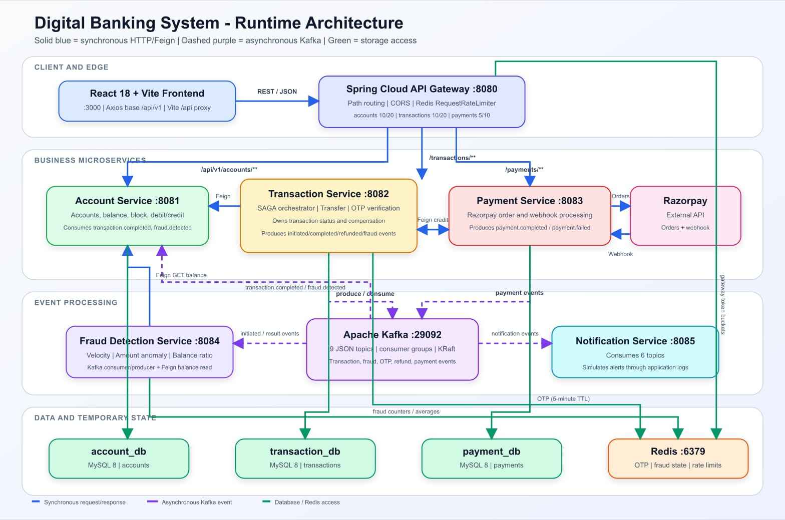

# Digital Banking System

A Spring Boot microservices banking demo with account management, fund transfers, rule-based fraud detection, OTP verification, SAGA-style refund compensation, Razorpay order/webhook handling, Kafka events, Redis state, MySQL persistence, an API Gateway, and a React frontend.

This guide is organized for **interview preparation**. It explains what the code actually does, including incomplete paths and failure risks—not only the intended architecture.

---

## Contents

1. [Interview summary](#1-interview-summary)
2. [System architecture](#2-system-architecture)
3. [Components and ownership](#3-components-and-ownership)
4. [Communication: synchronous vs asynchronous](#4-communication-synchronous-vs-asynchronous)
5. [Complete transfer flow](#5-complete-transfer-flow)
6. [Other application flows](#6-other-application-flows)
7. [REST endpoint catalog](#7-rest-endpoint-catalog)
8. [Kafka event catalog](#8-kafka-event-catalog)
9. [Database architecture and schemas](#9-database-architecture-and-schemas)
10. [Redis data model](#10-redis-data-model)
11. [Frontend behavior](#11-frontend-behavior)
12. [Error handling and failure behavior](#12-error-handling-and-failure-behavior)
13. [Design decisions and trade-offs](#13-design-decisions-and-trade-offs)
14. [Known gaps and interview discussion points](#14-known-gaps-and-interview-discussion-points)
15. [How to run](#15-how-to-run)
16. [Interview questions and answers](#16-interview-questions-and-answers)
17. [Source-code map](#17-source-code-map)

---

## 1. Interview summary

### 30-second explanation

The application has a React frontend and six Spring Boot services. Client traffic enters through Spring Cloud Gateway. Account, transaction, and payment data are stored in separate MySQL schemas. Immediate money operations use synchronous OpenFeign REST calls. Fraud checks, receiver credit, account blocking, and notifications use Kafka events. Redis stores API rate-limit state, fraud counters, running transaction averages, and five-minute OTPs. Transaction Service acts as a SAGA orchestrator: it deducts the sender first, requests fraud analysis, completes a clean or OTP-approved transaction, and refunds the sender when OTP verification fails or expires.

### Important patterns

| Pattern | Implementation in this project |
|---|---|
| API Gateway | Spring Cloud Gateway routes `/accounts`, `/transactions`, and `/payments` paths |
| Database per service | Account, Transaction, and Payment services own separate MySQL schemas |
| Synchronous communication | OpenFeign calls for deduct, credit/refund, and balance lookup |
| Event-driven communication | Nine Kafka topics carry transaction, fraud, OTP, refund, and payment events |
| SAGA-style compensation | Transaction Service refunds the sender on wrong or expired OTP |
| Temporary distributed state | Redis stores OTPs and fraud statistics |
| Eventual consistency | Receiver credit happens after `transaction.completed` is consumed |

### Technology stack

| Area | Technology |
|---|---|
| Backend | Java 17, Spring Boot 3.2.0 |
| Gateway | Spring Cloud Gateway 2023.0.0 |
| Service calls | Spring Cloud OpenFeign |
| Persistence | Spring Data JPA, Hibernate, MySQL 8 |
| Messaging | Apache Kafka 7.6.0 in KRaft mode |
| Temporary state | Redis |
| Payments | Razorpay Java SDK |
| Frontend | React 18, Vite 5, Axios, React Router, Tailwind CSS |
| Infrastructure | Docker Compose |

---

## 2. System architecture




[Open the full-size architecture diagram](docs/diagrams/system-arc.jpg)

### Request entry path

```text
Browser
  -> React/Vite :3000
  -> Vite proxies /api to API Gateway :8080
  -> Gateway applies CORS and Redis-backed IP rate limiting
  -> Gateway routes the unchanged request path to :8081, :8082, or :8083
```

Fraud Detection and Notification services are not routed through the Gateway because they do not expose business REST endpoints. They work as Kafka consumers.

### Runtime ports

| Component | Port | Access type |
|---|---:|---|
| React/Vite frontend | 3000 | Browser UI |
| API Gateway | 8080 | Public application API |
| Account Service | 8081 | Gateway + internal Feign |
| Transaction Service | 8082 | Gateway |
| Payment Service | 8083 | Gateway + Razorpay webhook |
| Fraud Detection Service | 8084 | Kafka worker; Actuator only |
| Notification Service | 8085 | Kafka worker; Actuator only |
| MySQL | 3306 | Persistence |
| Redis | 6379 | Rate limits, fraud state, OTP |
| Kafka external listener | 9092 | Host tooling |
| Kafka internal advertised listener | 29092 | Application configuration |

---

## 3. Components and ownership

### Frontend

Routes pages, collects form data, calls the API through Axios, renders account/transaction state, and displays toasts. It does not contain authentication or persistent client-side account state.

### API Gateway — `:8080`

- Routes account paths to `:8081`.
- Routes transaction paths to `:8082`.
- Routes payment paths to `:8083`.
- Uses Redis-backed `RequestRateLimiter`.
- Resolves rate-limit keys from the remote client IP.
- Allows CORS from `http://localhost:3000` and `http://localhost:3001`.
- Uses hardcoded localhost URLs; there is no service discovery.

Rate limits:

| Route | Replenish rate | Burst capacity |
|---|---:|---:|
| `/api/v1/accounts/**` | 10 requests/s | 20 |
| `/api/v1/transactions/**` | 10 requests/s | 20 |
| `/api/v1/payments/**` | 5 requests/s | 10 |

Source: [Gateway application.yml](api-gateway/src/main/resources/application.yml:24), [RateLimiterConfig](api-gateway/src/main/java/com/banking/apigateway/config/RateLimiterConfig.java:11).

### Account Service — `:8081`

Owns account identity, status, balances, account type, and daily transaction limit. It is the only service that changes account balances.

It exposes REST operations for create/read/block/deduct/credit and consumes:

- `transaction.completed` → credit receiver.
- `fraud.detected` → block sender account.

Source: [AccountController](account-service/src/main/java/com/banking/accountservice/controller/AccountController.java:15), [AccountService](account-service/src/main/java/com/banking/accountservice/service/AccountService.java:21).

### Transaction Service — `:8082`

Owns the transfer record and orchestrates the transfer SAGA:

1. Deduct sender synchronously.
2. Save transaction as `PROCESSING`.
3. Publish for fraud analysis.
4. Complete a clean transfer or wait for OTP.
5. Refund and optionally block the sender on verification failure.

It stores transaction records in `transaction_db` and OTPs in Redis.

Source: [TransactionService](transaction-service/src/main/java/com/banking/transactionservice/service/TransactionService.java:25), [TransactionEventConsumer](transaction-service/src/main/java/com/banking/transactionservice/service/TransactionEventConsumer.java:19).

### Payment Service — `:8083`

Creates Razorpay orders, stores local payment records, and handles `payment.captured` / `payment.failed` webhooks. On capture it synchronously credits the specified bank account and publishes a notification event.

Source: [PaymentController](payment-service/src/main/java/com/banking/paymentservice/controller/PaymentController.java:16), [PaymentService](payment-service/src/main/java/com/banking/paymentservice/service/PaymentService.java:24).

### Fraud Detection Service — `:8084`

A Kafka worker with no database. It consumes `transaction.initiated`, fetches the current sender balance from Account Service, runs three rules, then publishes either `fraud.check.clean` or `verification.required`.

Rules are evaluated in this order:

1. More than five initiated transactions within a 60-second Redis window.
2. Current amount greater than three times the stored running average.
3. Current amount greater than 90% of the fetched account balance.

**Important implementation detail:** sender balance is fetched after Transaction Service already deducted the amount. Therefore the 90% comparison uses the **remaining balance**, not the pre-transfer balance.

Source: [FraudDetectionService](fraud-detection-service/src/main/java/com/banking/frauddetectionservice/service/FraudDetectionService.java:39).

### Notification Service — `:8085`

Consumes transaction/payment events and formats alerts. `sendAlert()` currently writes to application logs; it does not integrate with email, SMS, or push providers.

Source: [NotificationService](notification-service/src/main/java/com/banking/notificationservice/service/NotificationService.java:14).

---

## 4. Communication: synchronous vs asynchronous

### Synchronous communication

A synchronous call blocks until the called service responds or fails.

| Caller | Callee | Call | Reason |
|---|---|---|---|
| Frontend | Gateway | All UI API requests | UI needs an HTTP result |
| Gateway | Account/Transaction/Payment | Route forwarding | Reverse-proxy request/response |
| Transaction | Account | `PUT .../deduct` | Transfer must not continue until deduction succeeds |
| Transaction | Account | `PUT .../credit` | Refund is attempted before the transaction is saved as `FLAGGED` |
| Fraud | Account | `GET .../balance` | Fraud rule needs a balance immediately |
| Payment | Razorpay | Create order | Payment Service needs the Razorpay order ID |
| Payment | Account | `PUT .../credit` | Captured payment attempts to credit the account immediately |

Internal service calls use interfaces annotated with `@FeignClient`:

- [Transaction AccountServiceClient](transaction-service/src/main/java/com/banking/transactionservice/client/AccountServiceClient.java:11)
- [Fraud AccountServiceClient](fraud-detection-service/src/main/java/com/banking/frauddetectionservice/client/AccountServiceClient.java:10)
- [Payment AccountServiceClient](payment-service/src/main/java/com/banking/paymentservice/client/AccountServiceClient.java:10)

### Asynchronous communication

The producer sends an event to Kafka and does not wait for all consumers to finish.

| Producer | Topic | Consumer(s) | Effect |
|---|---|---|---|
| Transaction | `transaction.initiated` | Fraud | Starts fraud analysis |
| Fraud | `fraud.check.clean` | Transaction | Completes a clean transaction |
| Fraud | `verification.required` | Transaction | Generates/stores OTP and waits for verification |
| Transaction | `transaction.otp.generated` | Notification | Logs OTP alert |
| Transaction | `transaction.completed` | Account, Notification | Credits receiver and logs debit/credit alerts |
| Transaction | `transaction.refunded` | Notification | Logs refund alert |
| Transaction | `fraud.detected` | Account, Notification | Blocks sender and logs fraud alert |
| Payment | `payment.completed` | Notification | Logs payment success |
| Payment | `payment.failed` | Notification | Logs payment failure |

### Consistency model

- Each individual database write is locally transactional only where the method has `@Transactional`.
- There is no distributed transaction across Account and Transaction databases.
- Kafka-driven changes are eventually consistent.
- The code demonstrates compensation, but it does **not** implement a transactional outbox, event idempotency, exactly-once processing, retries, or dead-letter topics.

---

## 5. Complete transfer flow

The transfer is documented below as source-backed Markdown sequences so each synchronous call, Kafka event, state transition, and compensation step remains searchable and easy to explain in an interview.

### 5.1 Initial request and deduction

Request:

```http
POST /api/v1/transactions/transfer
Content-Type: application/json
```

```json
{
  "senderAccountNumber": "378669440034",
  "receiverAccountNumber": "959032407792",
  "amount": 5000,
  "description": "Rent payment"
}
```

Execution:

1. Vite proxies `/api` to Gateway `:8080`.
2. Gateway applies the transaction rate limit and forwards the path to Transaction Service `:8082`.
3. `TransactionController.transfer()` validates required fields and positive amount.
4. `TransactionService.transfer()` synchronously calls Account Service through Feign.
5. Account Service loads the sender and checks:
   - account exists;
   - status is `ACTIVE`;
   - balance is at least the requested amount.
6. Account Service subtracts and saves the balance in a local transaction.
7. Transaction Service creates a record with:
   - `type = TRANSFER`;
   - `status = PROCESSING`;
   - random UUID `referenceNumber`.
8. Transaction Service calls `kafkaTemplate.send("transaction.initiated", transactionId, event)`.
9. The HTTP response is returned with status `201 Created` and transaction status `PROCESSING`.

Source: [TransactionService.transfer](transaction-service/src/main/java/com/banking/transactionservice/service/TransactionService.java:43), [AccountService.deductBalance](account-service/src/main/java/com/banking/accountservice/service/AccountService.java:82).

### 5.2 Fraud analysis

Fraud Service consumes `transaction.initiated` and synchronously asks Account Service for the sender's **post-deduction** balance.

Checks stop at the first suspicious result:

| Order | Rule | Result when suspicious |
|---:|---|---|
| 1 | Redis velocity counter > 5 in 60 seconds | `verification.required` |
| 2 | Amount > stored average × 3 | `verification.required` |
| 3 | Amount > fetched remaining balance × 0.90 | `verification.required` |
| — | No rule matches | `fraud.check.clean` |

### 5.3 Clean path

1. Fraud Service publishes `fraud.check.clean`.
2. Transaction Service consumes it.
3. It loads the transaction and continues only if status is still `PROCESSING`.
4. It changes status to `COMPLETED`, sets `completedAt`, and saves.
5. It publishes `transaction.completed`.
6. Account Service consumes the event and credits `receiverAccountNumber`.
7. Notification Service independently consumes the same topic and logs debit/credit alerts.

The receiver credit is eventually consistent: the transfer record is marked `COMPLETED` before Account Service consumes the credit event.

### 5.4 Suspicious path and OTP generation

1. Fraud Service publishes `verification.required` with transaction ID, sender account, amount, and reason.
2. Transaction Service consumes it and checks that the transaction is `PROCESSING`.
3. It generates a six-digit value using `Math.random()`.
4. It stores the value under `verification:otp<transactionId>` with a five-minute TTL.
5. It changes transaction status to `PENDING_VERIFICATION`.
6. It publishes `transaction.otp.generated`.
7. Notification Service logs the OTP and reason.

### 5.5 Correct OTP path

```http
POST /api/v1/transactions/{transactionId}/verify?otp=123456
```

1. Transaction Service loads the transaction and Redis OTP.
2. If the values match, it deletes the Redis key.
3. It marks the transaction `COMPLETED`.
4. It publishes `transaction.completed`.
5. Account Service credits the receiver asynchronously.
6. Notification Service logs debit/credit alerts.

### 5.6 Expired OTP compensation

1. Redis returns `null` because the key expired or is absent.
2. Transaction Service synchronously calls Account Service `credit` for the sender.
3. It sets status `FLAGGED` and stores a failure reason with a timestamp.
4. It publishes `transaction.refunded`.
5. Notification Service logs a refund alert.

An expired OTP does not publish `fraud.detected`, so it does not block the sender.

### 5.7 Wrong OTP compensation and blocking

1. Transaction Service deletes the OTP key.
2. It publishes `fraud.detected` with the sender account and reason.
3. Account Service asynchronously blocks the sender.
4. Notification Service logs the block alert.
5. Transaction Service synchronously credits the sender as compensation.
6. It marks the transaction `FLAGGED`.
7. It publishes `transaction.refunded`.

### 5.8 Actual status state machine

```text
PROCESSING --fraud.check.clean----------------------> COMPLETED
PROCESSING --verification.required------------------> PENDING_VERIFICATION
PENDING_VERIFICATION --correct OTP------------------> COMPLETED
PENDING_VERIFICATION --wrong or absent/expired OTP--> FLAGGED
```

`PENDING` and `FAILED` exist in the enum but are not assigned in the current transfer implementation.

---

## 6. Other application flows

### 6.1 Create account

```text
CreateAccount page
  -> POST /api/v1/accounts
  -> Gateway :8080
  -> AccountController :8081
  -> validate DTO
  -> check existsByEmail
  -> generate unique 12-digit account number with SecureRandom
  -> ACTIVE + initial balance + account-type limit
  -> save account_db.accounts
  -> return 201 AccountResponse
```

Limits assigned during creation:

| Type | Daily limit stored |
|---|---:|
| `SAVINGS` | 100000.00 |
| `CURRENT` | 500000.00 |
| `FIXED_DEPOSIT` | 500000.00 |

The limit is stored but not enforced by Transaction Service.

### 6.2 Account lookup

```text
Dashboard / AccountDetails
  -> GET /api/v1/accounts/{accountNumber}
  -> AccountRepository.findByAccountNumber
  -> AccountResponse or 404
```

### 6.3 Balance lookup

`GET /api/v1/accounts/{accountNumber}/balance` returns a raw JSON number (`BigDecimal`). The frontend defines this API function but does not call it. Fraud Service calls it synchronously.

### 6.4 Manual account block

```text
AccountDetails page confirmation
  -> PUT /api/v1/accounts/{accountNumber}/block
  -> status = BLOCKED
  -> save
```

A blocked account cannot be debited because `deductBalance()` requires `ACTIVE`. It can still be credited because `creditBalance()` performs no status check.

### 6.5 Transaction history

```text
Transactions page
  -> GET /api/v1/transactions/account/{accountNumber}
  -> findBySenderAccountNumberOrderByCreatedAtDesc
  -> sender-side transactions only
```

Incoming receiver-side transactions are not returned by the repository query.

### 6.6 Add Money page

The current UI does **not** use Razorpay. It directly calls:

```http
PUT /api/v1/accounts/{accountNumber}/credit?amount=...
```

Account Service immediately increments the balance. This is a development simulation and exposes an internal money-changing endpoint through the Gateway.

### 6.7 Razorpay order flow

Create order:

1. Client calls `POST /api/v1/payments/create-order`.
2. Payment Service converts rupees to paise using `amount × 100` and `intValue()`.
3. It calls Razorpay's Orders API synchronously.
4. It saves a local payment with status `CREATED`.
5. It returns payment ID, Razorpay order ID, amount, INR currency, public key ID, and status.

Webhook success (`payment.captured`):

1. Extract `payload.payment.entity`.
2. Find payment by `order_id`.
3. Save status `COMPLETED` and Razorpay payment ID.
4. Synchronously credit Account Service.
5. Publish `payment.completed`.

Webhook failure (`payment.failed`):

1. Find payment by `order_id`.
2. Save status `FAILED` and failure reason.
3. Publish `payment.failed`.

Webhook signature verification is not implemented even though a webhook secret property exists.

---

## 7. REST endpoint catalog

All client-facing paths are called through `http://localhost:8080`. Internal Feign calls target Account Service directly on `http://localhost:8081`.

### Account Service

| Method | Path | Called by | Request | Response / effect |
|---|---|---|---|---|
| POST | `/api/v1/accounts` | CreateAccount UI | `CreateAccountRequest` JSON | `201 AccountResponse` |
| GET | `/api/v1/accounts/{accountNumber}` | Dashboard, AccountDetails | Path variable | `200 AccountResponse` |
| GET | `/api/v1/accounts/{accountNumber}/balance` | Fraud Feign; API helper exists | Path variable | `200 BigDecimal` |
| PUT | `/api/v1/accounts/{accountNumber}/block` | AccountDetails; fraud uses event instead | Path variable | `200` text |
| PUT | `/api/v1/accounts/{accountNumber}/deduct?amount={value}` | Transaction Feign | Path + query | Debit or error |
| PUT | `/api/v1/accounts/{accountNumber}/credit?amount={value}` | AddMoney UI, Transaction Feign, Payment Feign | Path + query | Credit balance |

### Transaction Service

| Method | Path | Called by | Request | Response / effect |
|---|---|---|---|---|
| POST | `/api/v1/transactions/transfer` | Transfer UI | `TransferRequest` JSON | `201 TransactionResponse`, initially `PROCESSING` |
| GET | `/api/v1/transactions/{transactionId}` | API helper exists; no page uses it | Transaction ID | `200 TransactionResponse` |
| GET | `/api/v1/transactions/account/{accountNumber}` | Transactions UI | Account number | Sender-side history list |
| POST | `/api/v1/transactions/{transactionId}/verify?otp={value}` | OTP API/UI path | Transaction ID + OTP query | Updated transaction |

### Payment Service

| Method | Path | Called by | Request | Response / effect |
|---|---|---|---|---|
| POST | `/api/v1/payments/create-order` | API helper exists; no current page uses it | `CreatePaymentRequest` JSON | `201 PaymentOrderResponse` |
| POST | `/api/v1/payments/webhook` | Razorpay | Webhook JSON | Processes known event; returns `200` text |

### Actuator exposure

- Gateway: `health`, `info`, `gateway`.
- All other services: `health`, `info`.

---

## 8. Kafka event catalog

Serialization:

```text
Producer: StringSerializer key + JsonSerializer value
Consumer: StringDeserializer key + JsonDeserializer value
Type headers disabled; default consumer value type = HashMap
```

| Topic | Key used | Producer | Consumer(s) | Payload fields |
|---|---|---|---|---|
| `transaction.initiated` | transaction ID | Transaction | Fraud | `transactionId`, `senderAccountNumber`, `receiverAccountNumber`, `amount`, `description` |
| `fraud.check.clean` | transaction ID | Fraud | Transaction | `transactionId`, `isFraud`, `reason` |
| `verification.required` | transaction ID | Fraud | Transaction | `transactionId`, `accountNumber`, `amount`, `reason` |
| `transaction.otp.generated` | transaction ID | Transaction | Notification | `transactionId`, `accountNumber`, `reason`, `otp`, `amount` |
| `transaction.completed` | transaction ID | Transaction | Account, Notification | `transactionId`, `senderAccountNumber`, `receiverAccountNumber`, `amount`, `description` |
| `transaction.refunded` | transaction ID | Transaction | Notification | `transactionId`, `senderAccountNumber`, `amount`, `reason` |
| `fraud.detected` | sender account number | Transaction | Account, Notification | `transactionId`, `accountNumber`, `reason` |
| `payment.completed` | local payment ID | Payment | Notification | `paymentId`, `accountNumber`, `amount`, `razorpayPaymentId` |
| `payment.failed` | local payment ID | Payment | Notification | `paymentId`, `accountNumber`, `amount`, `reason` |

Consumer groups:

| Service | Consumer group |
|---|---|
| Account | `account-service-group` |
| Transaction | `transaction-service-group` |
| Fraud Detection | `fraud-detection-group` |
| Notification | `notification-service-group` |

Different groups consuming `transaction.completed` each receive the event: Account credits the receiver while Notification logs alerts.

---

## 9. Database architecture and schemas

The schemas are documented as Markdown tables rather than an ER image because the application has no database-level relationships between services.

### Ownership model

```text
Account Service     -> account_db.accounts
Transaction Service -> transaction_db.transactions
Payment Service     -> payment_db.payments
Fraud Service       -> no database
Notification Service-> no database
```

There are no JPA relationships or foreign keys between schemas. Account numbers are copied as strings into transaction/payment records. Cross-service validation and state changes happen through REST or Kafka.

Hibernate uses `ddl-auto: update`; schemas are created through `createDatabaseIfNotExist=true`.

### `account_db.accounts`

| Field | JPA definition | Constraints / behavior |
|---|---|---|
| `id` | String UUID | Primary key, `GenerationType.UUID` |
| `account_number` | String | Unique, non-null; generated as 12 digits |
| `account_holder_name` | String | Non-null |
| `email` | String | Non-null; duplicate checked in service code |
| `phone` | String | Non-null |
| `account_type` | Enum string | `SAVINGS`, `CURRENT`, `FIXED_DEPOSIT` |
| `status` | Enum string | `ACTIVE`, `BLOCKED`, `CLOSED` |
| `balance` | Decimal(15,2) | Non-null |
| `daily_transaction_limit` | Decimal(15,2) | Non-null, stored but not enforced |
| `created_at` | LocalDateTime | `@CreationTimestamp` |
| `updated_at` | LocalDateTime | `@UpdateTimestamp` |

### `transaction_db.transactions`

| Field | JPA definition | Constraints / behavior |
|---|---|---|
| `id` | String UUID | Primary key |
| `sender_account_number` | String | Non-null, logical account reference |
| `receiver_account_number` | String | Non-null, logical account reference |
| `amount` | Decimal(15,2) | Non-null |
| `type` | Enum string | `TRANSFER`, `DEPOSIT`, `WITHDRAWAL`, `PAYMENT` |
| `status` | Enum string | `PENDING`, `PROCESSING`, `PENDING_VERIFICATION`, `COMPLETED`, `FAILED`, `FLAGGED` |
| `description` | String | Nullable |
| `failure_reason` | String | Nullable; set on compensation |
| `reference_number` | String | UUID text generated for transfer |
| `created_at` | LocalDateTime | `@CreationTimestamp` |
| `completed_at` | LocalDateTime | Set on completion |

### `payment_db.payments`

| Field | JPA definition | Constraints / behavior |
|---|---|---|
| `id` | String UUID | Primary key |
| `razorpay_order_id` | String | Used to find record during webhook |
| `razorpay_payment_id` | String | Set on capture |
| `account_number` | String | Non-null, logical Account Service reference |
| `amount` | Decimal(15,2) | Non-null |
| `currency` | String | Non-null; code sets `INR` |
| `status` | Enum string | `CREATED`, `PENDING`, `COMPLETED`, `FAILED`, `REFUNDED` |
| `description` | String | Nullable |
| `failure_reason` | String | Nullable |
| `created_at` | LocalDateTime | `@CreationTimestamp` |
| `updated_at` | LocalDateTime | `@UpdateTimestamp` |

> Exact physical VARCHAR sizes are controlled by Hibernate/MySQL defaults where `@Column(length=...)` is not specified. The tables above document the JPA model and constraints without claiming a narrower physical length for account-number fields.

---

## 10. Redis data model

| Key | Owner | Value | TTL | Operations |
|---|---|---|---:|---|
| `verification:otp<transactionId>` | Transaction | Six-digit OTP string | 5 minutes | SET, GET, DELETE |
| `fraud:velocity<accountNumber>` | Fraud | Incrementing count | 60 seconds | INCR, EXPIRE |
| `fraud:avg_amount<accountNumber>` | Fraud | Decimal as string | None | GET, SET |
| Gateway rate-limit keys | Gateway | Token-bucket state | Framework-managed | Redis Lua/scripts managed by Gateway |

The key strings concatenate the prefix and identifier without an extra separator, exactly as implemented.

Running average formula:

```text
newAverage = (oldAverage + currentAmount) / 2
```

This is an exponentially weighted update, not a true arithmetic average over all historical transactions.

---

## 11. Frontend behavior

### Routes and API calls

| Frontend route | Component | API calls |
|---|---|---|
| `/` | Dashboard | `GET /accounts/{accountNumber}` |
| `/create-account` | CreateAccount | `POST /accounts` |
| `/transfer` | Transfer | `POST /transactions/transfer`, optionally verify OTP |
| `/transactions` | Transactions | `GET /transactions/account/{accountNumber}` |
| `/add-money` | AddMoney | Direct `PUT /accounts/{accountNumber}/credit` |
| `/account/:accountNumber` | AccountDetails | Get account, manually block account |

Axios is configured with `baseURL: '/api/v1'` in [frontend/src/services/api.js](frontend/src/services/api.js:3). Vite proxies `/api` to the Gateway in [vite.config.js](frontend/vite.config.js:13).

### Functions defined but not used by a page

- `getBalance()`
- `getTransaction()`
- `createPaymentOrder()`

### OTP UI mismatch

The transfer endpoint returns immediately with `PROCESSING`. Fraud analysis happens after the response through Kafka. The Transfer page opens the OTP modal only when the initial response status is already `PENDING_VERIFICATION`. Therefore the current page does not automatically discover the later state change. There is no polling, WebSocket, SSE, or event subscription. In practice, the OTP and transaction ID must be observed in logs and verification called separately unless the UI is enhanced.

---

## 12. Error handling and failure behavior

### Account HTTP errors

`GlobalExceptionHandler` maps `RuntimeException` by checking message text:

| Message contains | HTTP status |
|---|---:|
| `already exists` | 400 |
| `not found` | 404 |
| Any other runtime error | 500 |

Validation failures use Spring's default validation response because no handler is defined for `MethodArgumentNotValidException`.

### Transaction and Payment HTTP errors

They do not define a global exception handler, so unhandled exceptions use Spring Boot's default error response.

### Kafka consumer errors

Consumers catch broad `Exception` and log only the message. The project does not configure:

- retries;
- dead-letter topics;
- manual acknowledgements;
- replay/reconciliation logic;
- consumer-side idempotency.

### Important failure windows

| Failure point | Actual result |
|---|---|
| Sender deduction fails | Transfer stops before transaction save |
| Sender deducted, then transaction save fails | Sender may remain debited; there is no automatic compensation around this failure |
| Transaction saved, Kafka send fails asynchronously | HTTP may already return; transaction can remain `PROCESSING` |
| Fraud consumer fails | Exception is logged; transaction can remain `PROCESSING` |
| Transaction marked `COMPLETED`, receiver consumer fails | Receiver may not be credited until successful replay; no idempotency guard exists |
| Duplicate `transaction.completed` | Receiver can be credited more than once |
| Payment saved `COMPLETED`, Account credit fails | Exception is caught; payment remains `COMPLETED`, account may not be credited, success event is not sent |
| Duplicate Razorpay capture webhook | Account can be credited repeatedly because webhook idempotency is absent |

---

## 13. Design decisions and trade-offs

### Why Feign for debit/refund/balance?

These operations need an immediate result. Transaction Service cannot safely start its next intended step if the sender debit fails; Fraud Service cannot evaluate its balance rule without a balance response.

### Why Kafka for fraud and notification?

Fraud processing and notifications are decoupled from the initiating HTTP request. Kafka also allows fan-out: both Account and Notification services independently consume `transaction.completed`.

### Why Redis?

- Atomic `INCR` and TTL are appropriate for velocity windows.
- OTPs are short-lived and automatically expire.
- Gateway rate limiting needs fast shared state across gateway instances.

### Why separate schemas?

Each service owns its data and can evolve independently. The trade-off is no cross-service joins, no database foreign keys, and eventual consistency between transaction status and account balances.

### Is this a complete SAGA implementation?

It demonstrates an **orchestrator and compensating action**, but not a production-complete SAGA. A stronger implementation would add a transactional outbox, idempotent consumers, durable SAGA state, timeout/recovery processing, retry/DLQ policies, and reconciliation.

---

## 14. Known gaps and interview discussion points

1. No authentication, authorization, JWT, or Spring Security.
2. Internal debit/credit/block endpoints are exposed through the Gateway.
3. Transfer does not validate that the receiver exists before deducting sender funds.
4. Daily transaction limit is stored but never enforced.
5. Account balance updates use read-modify-write without `@Version`, locking, or atomic SQL updates.
6. Transfer is not idempotent; client retries can deduct twice.
7. Kafka consumers are not idempotent; duplicate events can duplicate credits.
8. There is no transactional outbox between database commits and Kafka sends.
9. No retry, dead-letter topic, or stuck-transaction recovery.
10. OTP uses `Math.random()` and is stored in plaintext.
11. `verifyOTP()` does not validate that status is `PENDING_VERIFICATION`; repeated/late calls can produce incorrect compensation behavior.
12. Fraud balance-ratio rule uses the post-deduction balance.
13. Amount-average key has no TTL and uses `(old + current)/2`, not a full historical average.
14. Transaction history returns only sender-side transactions.
15. Add Money bypasses Payment Service and Razorpay.
16. Razorpay webhook signature and idempotency are not verified.
17. Payment status is saved as `COMPLETED` before account credit succeeds.
18. Notification Service only logs; it sends no real messages.
19. Services and Gateway use hardcoded localhost addresses; no discovery/load balancing.
20. Secrets and database credentials are committed as plain configuration placeholders/defaults.
21. No automated tests were found in the repository.
22. No distributed tracing, correlation filters, metrics dashboards, or centralized logs.

---

## 15. How to run

### Prerequisites

- Docker Desktop
- Java 17
- Maven
- Node.js/npm

### Start infrastructure

```bash
docker-compose up -d
```

This starts MySQL, Redis, and Kafka. Kafka runs in single-node KRaft mode with topic auto-creation enabled.

### Start backend services

Run each command in its own terminal from the repository root:

```bash
cd account-service && mvn spring-boot:run
cd transaction-service && mvn spring-boot:run
cd payment-service && mvn spring-boot:run
cd fraud-detection-service && mvn spring-boot:run
cd notification-service && mvn spring-boot:run
cd api-gateway && mvn spring-boot:run
```

Recommended order:

```text
Infrastructure -> Account -> Transaction -> Fraud -> Notification -> Payment -> Gateway -> Frontend
```

### Start frontend

```bash
cd frontend
npm install
npm run dev
```

Open `http://localhost:3000`.

### Razorpay configuration

Replace placeholder values in `payment-service/src/main/resources/application.yml`:

```yaml
razorpay:
  key-id: your_key_id
  key-secret: your_key_secret
  webhook-secret: your-webhook-secret
```

The webhook secret is currently not used for verification. Do not use this implementation for real payments without fixing that.

### Useful inspection commands

```bash
# Accounts
docker exec mysql mysql -uroot -proot -e \
  'SELECT account_number, account_holder_name, balance, status FROM account_db.accounts;'

# Transactions
docker exec mysql mysql -uroot -proot -e \
  'SELECT id, sender_account_number, receiver_account_number, amount, status FROM transaction_db.transactions;'

# Payments
docker exec mysql mysql -uroot -proot -e \
  'SELECT id, razorpay_order_id, account_number, amount, status FROM payment_db.payments;'

# Redis state
docker exec -it redis redis-cli KEYS '*'

# Kafka topics
docker exec -it kafka kafka-topics --bootstrap-server localhost:9092 --list
```

---

## 16. Interview questions and answers

### How would you explain the transfer SAGA?

Transaction Service is the orchestrator. It first performs a synchronous debit in Account Service, saves a `PROCESSING` transaction, and publishes a Kafka event for fraud analysis. A clean result completes the transaction and emits another event that credits the receiver. A suspicious result requires OTP verification. Wrong or expired OTP triggers the compensating action: a synchronous credit back to the sender. This is eventual consistency with compensation rather than two-phase commit.

### Why not use a distributed transaction or 2PC?

2PC tightly couples participants, holds locks across services, reduces availability, and is difficult to operate at scale. SAGA favors local transactions and compensating actions. However, this project still needs an outbox and idempotency to make that approach reliable.

### What is the consistency problem with receiver credit?

Transaction Service saves `COMPLETED` before Account Service consumes `transaction.completed`. During that window, the transaction says complete while the receiver balance is unchanged. This is eventual consistency. Duplicate delivery can also double-credit because the consumer has no idempotency record.

### Why use Redis for velocity checking?

`INCR` is atomic, `EXPIRE` automatically closes the window, and Redis avoids database row contention for high-frequency counters. The same temporary-state model fits OTP expiry and distributed rate limiting.

### How does Kafka fan-out work here?

Account and Notification services use different consumer groups for `transaction.completed`. Kafka delivers a copy to each group. Multiple instances inside the same group would divide partitions among themselves.

### What happens when Account Service is unavailable during initial debit?

The Feign call fails and the transfer does not reach transaction creation. The error propagates to the HTTP request. The project has no circuit breaker or explicit Feign retry configuration.

### What happens when Account Service is unavailable during async receiver credit?

The consumer throws and catches the exception. No retry/DLQ policy is configured in application code. Recovery depends on Kafka listener container acknowledgment behavior and offset handling, which is not explicitly managed here. A production answer should add retryable topics/DLQ plus idempotent credit handling.

### What would you change first for production?

1. Authentication and authorization.
2. Atomic/idempotent money operations.
3. Transactional outbox and idempotent Kafka consumers.
4. Webhook signature verification and idempotency.
5. Retry/DLQ and stuck-SAGA recovery.
6. Receiver validation and daily-limit enforcement.
7. Tests, tracing, secrets management, and service discovery.

### Is the fraud model machine learning?

No. It is deterministic rule-based fraud detection using velocity, an amount threshold based on a Redis-stored moving value, and a balance percentage rule.

### Why is the current 90% fraud check potentially inaccurate?

The sender is debited before Fraud Service requests the balance. The rule compares the transfer amount against 90% of the remaining balance, making the threshold different from 90% of the original balance and causing more transfers to be flagged.

### How would you prevent concurrent balance corruption?

Use an atomic conditional update such as `UPDATE accounts SET balance = balance - ? WHERE account_number = ? AND status = 'ACTIVE' AND balance >= ?`, then verify the affected row count. Alternatively use optimistic locking with `@Version`, carefully retrying conflicts, or pessimistic row locking for the critical section.

### How would the frontend learn that Kafka changed the transaction to `PENDING_VERIFICATION`?

Add polling of `GET /transactions/{id}`, Server-Sent Events, or WebSocket notifications. The current initial HTTP response cannot contain a later asynchronous status transition.

---

## 17. Source-code map

| Concern | Main source |
|---|---|
| Gateway routes/rate limits/CORS | [api-gateway application.yml](api-gateway/src/main/resources/application.yml:1) |
| Rate-limit key | [RateLimiterConfig](api-gateway/src/main/java/com/banking/apigateway/config/RateLimiterConfig.java:11) |
| Account REST API | [AccountController](account-service/src/main/java/com/banking/accountservice/controller/AccountController.java:15) |
| Account rules and Kafka consumers | [AccountService](account-service/src/main/java/com/banking/accountservice/service/AccountService.java:21) |
| Account schema | [Account entity](account-service/src/main/java/com/banking/accountservice/model/Account.java:13) |
| Transaction REST API | [TransactionController](transaction-service/src/main/java/com/banking/transactionservice/controller/TransactionController.java:15) |
| Transfer/SAGA/OTP compensation | [TransactionService](transaction-service/src/main/java/com/banking/transactionservice/service/TransactionService.java:25) |
| Fraud-result consumers and OTP generation | [TransactionEventConsumer](transaction-service/src/main/java/com/banking/transactionservice/service/TransactionEventConsumer.java:19) |
| Transaction schema | [Transaction entity](transaction-service/src/main/java/com/banking/transactionservice/model/Transaction.java:12) |
| Fraud rules | [FraudDetectionService](fraud-detection-service/src/main/java/com/banking/frauddetectionservice/service/FraudDetectionService.java:18) |
| Fraud transaction listener | [Fraud TransactionEventConsumer](fraud-detection-service/src/main/java/com/banking/frauddetectionservice/service/TransactionEventConsumer.java:11) |
| Payment REST API | [PaymentController](payment-service/src/main/java/com/banking/paymentservice/controller/PaymentController.java:16) |
| Razorpay and webhook logic | [PaymentService](payment-service/src/main/java/com/banking/paymentservice/service/PaymentService.java:24) |
| Payment schema | [Payment entity](payment-service/src/main/java/com/banking/paymentservice/model/Payment.java:13) |
| Notification listeners | [NotificationService](notification-service/src/main/java/com/banking/notificationservice/service/NotificationService.java:11) |
| Frontend API wrapper | [api.js](frontend/src/services/api.js:1) |
| Frontend routes | [App.jsx](frontend/src/App.jsx:12) |
| Infrastructure | [docker-compose.yml](docker-compose.yml:1) |

### Architecture image

- [System architecture](docs/diagrams/system-architecture.svg)

Database schemas and application flows are intentionally maintained as Markdown tables and numbered sequences in this README.
